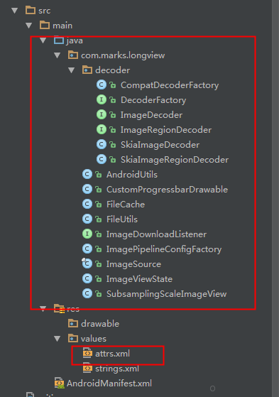
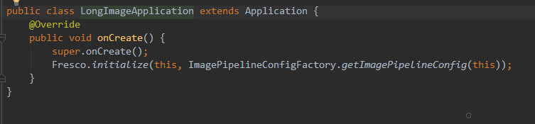
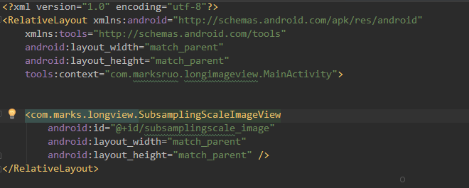
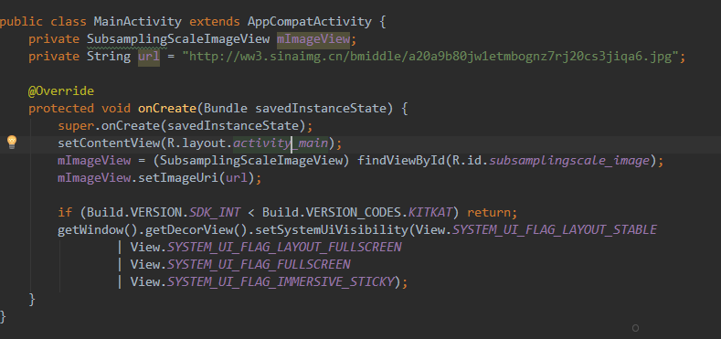

# 项目介绍
    因为项目需要加载超出屏幕的图片，类似新浪微薄长图，所以结合Github上的[Subsampling Scale Image View](https://github.com/davemorrissey/subsampling-scale-image-view)
    和Fresco图片加载框架一起实现该效果。后续会添加Glide等。
    
#使用说明
    方式一：
        直接使用 compile 'com.marks.longview:longimage:1.0.0' 引入依赖库
    方式二：
        拷贝longimage中的文件到你自定义路径下，然后自定义Application，设置Fresco的初始化，在xml中使用
        SubsamplingScaleImageView,在Activity中获取该控件，调用setImageUri方法传入uri地址即可。
 
 
 
 

    
#注意事项
    该项目中使用了Fresco等图片加载框架，所以如果需要混淆，请自行填加。
 
#更新日志
######1.0.2
    项目添加Glide加载方式:
     public void setImageUriByGlide(String url){
            setMaxScale(10.0F);
            setMinScale(1.0F);
            setMinimumScaleType(getImageType());
            Glide.with(this.getContext()).load(url).downloadOnly(new SimpleTarget<File>() {
                @Override
                public void onResourceReady(File resource, GlideAnimation<? super File> glideAnimation) {
                    setImage(ImageSource.uri(Uri.fromFile(resource)),new ImageViewState(1.0F,new PointF(0,0),0));
                }
            });
        }    
        
######1.0.1
[Subsampling Scale Image View](https://github.com/davemorrissey/subsampling-scale-image-view) 和Fresco 实现长图的加载

#联系方式
   Email:markruo92@gmail.com  
   
  